# Airbnb Market Comparison: Chicago vs New Orleans Pricing Analysis

## 📊 Project Overview

This project presents a Power BI analysis of the Airbnb market in **Chicago** and **New Orleans**. The dashboard is designed to compare listing availability, pricing, host/listing counts, neighbourhood distribution, and room-type composition across the two cities.

The analysis uses interactive filters for:

- **City:** Chicago / New Orleans
- **Room Type:** Hotel room / Private room / Shared room

Because the original Power BI `.pbix` file is not available for this submission, this repository documents the project through dashboard screenshots.

---

## 🎯 Project Objectives

The main objectives of the analysis are:

1. Compare Airbnb listing volumes between Chicago and New Orleans.
2. Compare average Airbnb prices across cities and room types.
3. Analyze the distribution of listings across neighbourhoods.
4. Understand the availability of different room types.
5. Compare review activity and reviews per month.
6. Examine how room type selection affects pricing and listing counts.
7. Identify useful market-level observations from the dashboard.

---

## 🛠️ Tools & Technologies

- **Microsoft Power BI** — Dashboard creation and visualization
- **Power Query** — Data preparation/transformation
- **DAX / Power BI measures** — KPI calculations and analysis
- **GitHub** — Project documentation and screenshot hosting

---

## 📌 Dashboard Components

The dashboard contains:

- City and Room Type slicers
- Total Listings KPI
- Average Price KPI
- Total Hosts KPI
- Reviews per Month KPI
- Total Number of Reviews
- Listings by Neighbourhood
- Room Type distribution
- Average rooms available
- Average availability over 365 days
- City-level comparison tables
- Filter-driven comparison views

---

## 📷 Dashboard Screenshots

### 1. New Orleans — Shared Room Filter

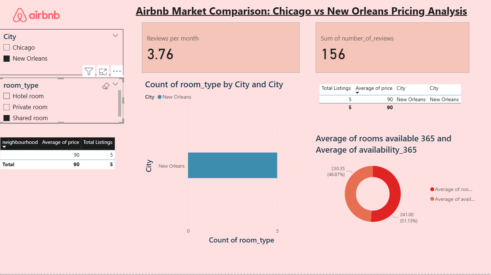

This view demonstrates the dashboard after selecting **New Orleans** and **Shared Room**, showing the corresponding listing count, average price, neighbourhood information and availability metrics.

---

### 2. New Orleans — Private Room Filter

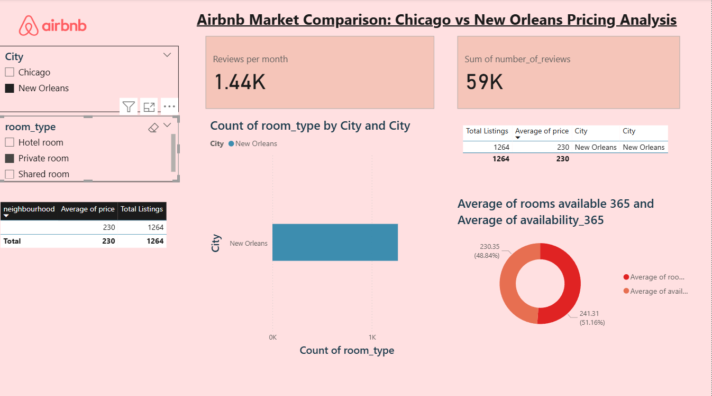

This filtered view focuses on **Private Room** listings in New Orleans and shows the change in KPIs and availability metrics.

---

### 3. New Orleans — Hotel Room Filter

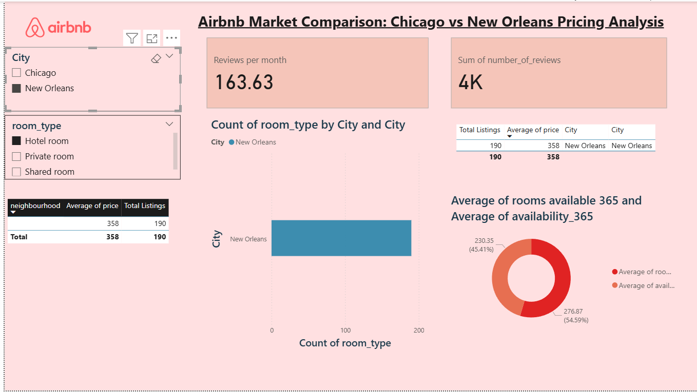

This view focuses on **Hotel Room** listings in New Orleans.

---

### 4. Chicago — Shared Room Filter

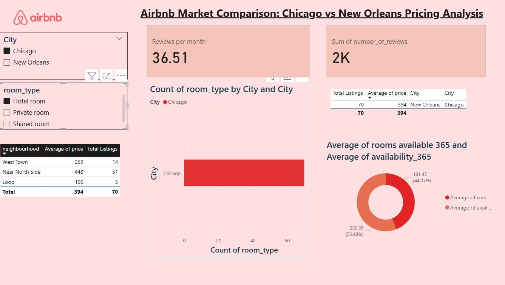

This view shows the dashboard for **Chicago + Shared Room**, including listing count, average price and neighbourhood-level information.

---

### 5. Combined Shared Room Comparison

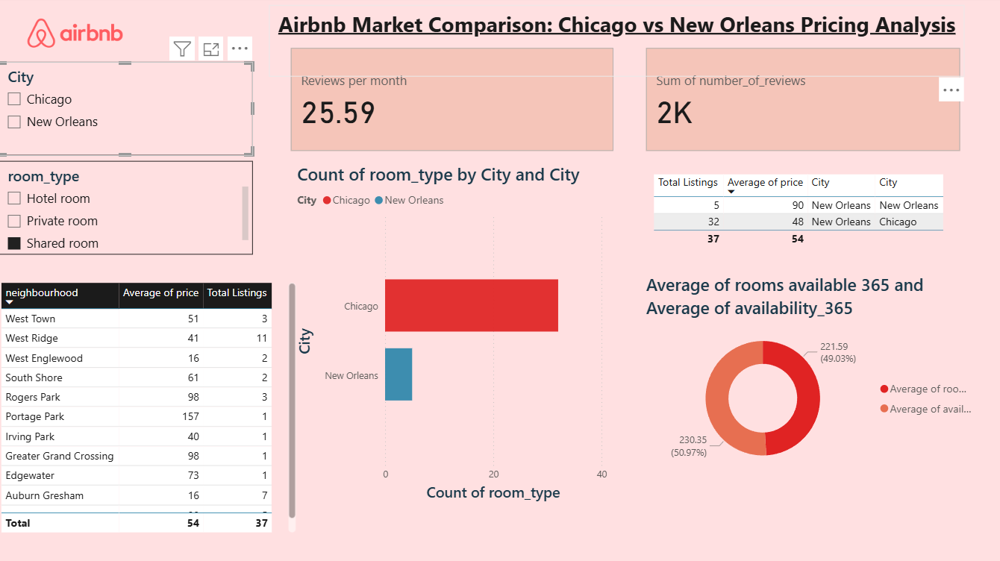

This view compares **Chicago and New Orleans** under the shared-room selection and demonstrates how the dashboard responds when both cities are considered together.

---

### 6. New Orleans — Overall View

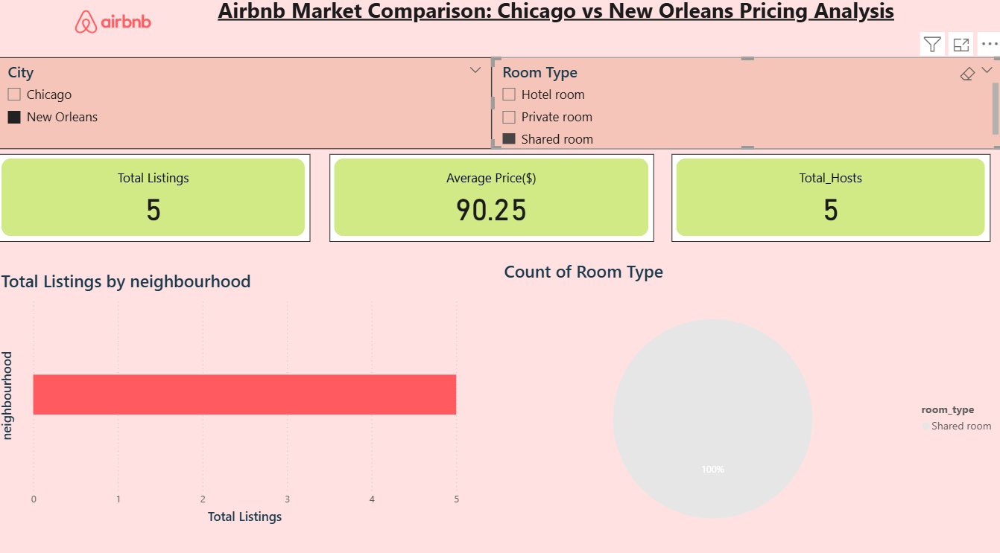

This view focuses on the broader New Orleans market and summarizes total listings, average price, hosts, neighbourhood distribution and room-type composition.

---

### 7. New Orleans — Private Room View

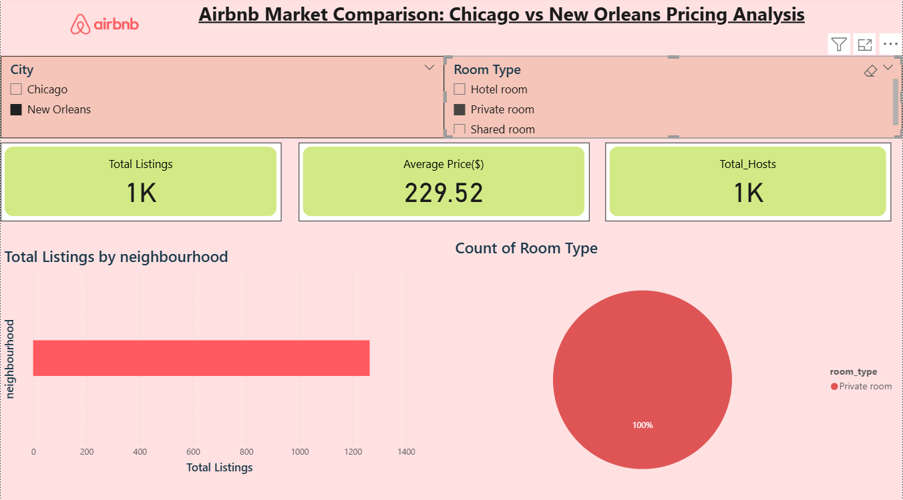

This view highlights the New Orleans private-room segment.

---

### 8. Chicago — Hotel Room View

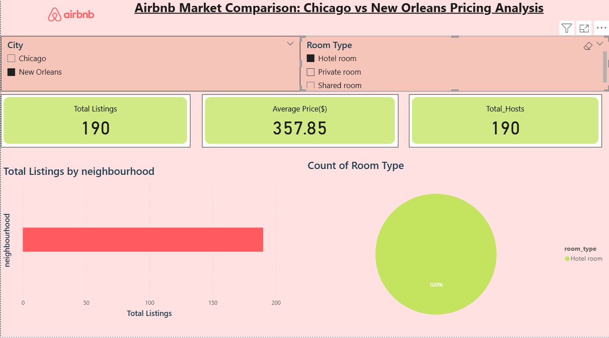

This view focuses on Chicago hotel-room listings and their neighbourhood distribution.

---

### 9. Chicago — Shared Room View

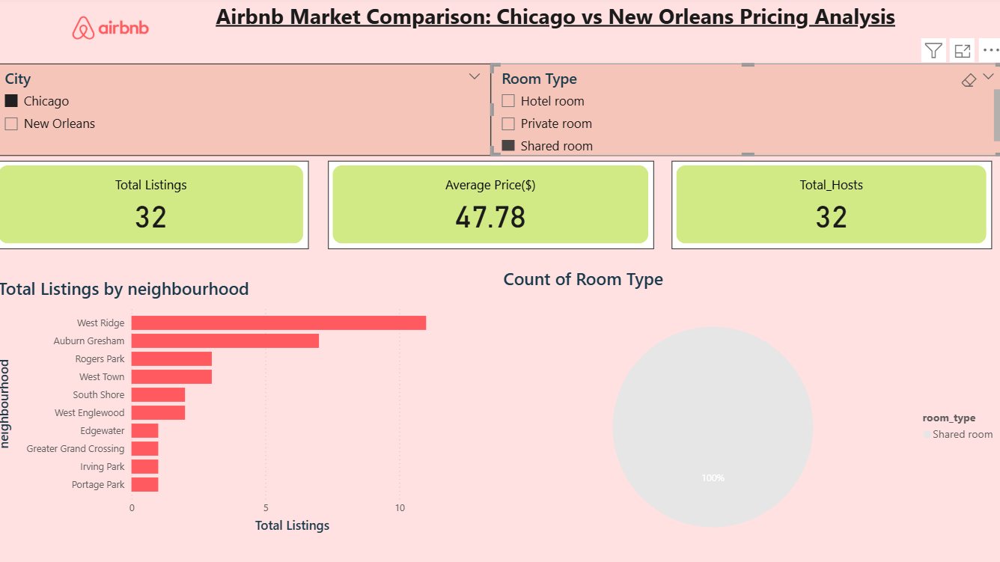

This view shows the Chicago shared-room segment and its corresponding KPIs and neighbourhood distribution.

---

### 10. Chicago — Private Room View

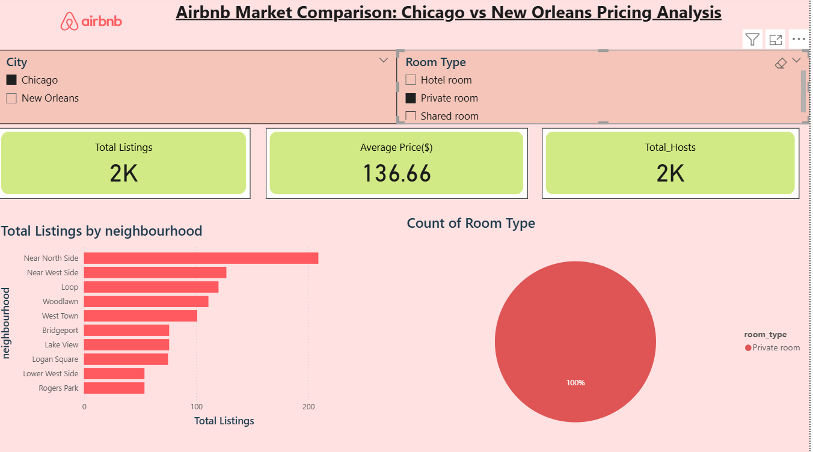

This view focuses on private-room listings in Chicago.

---

### 11. Chicago — Hotel Room Detailed View

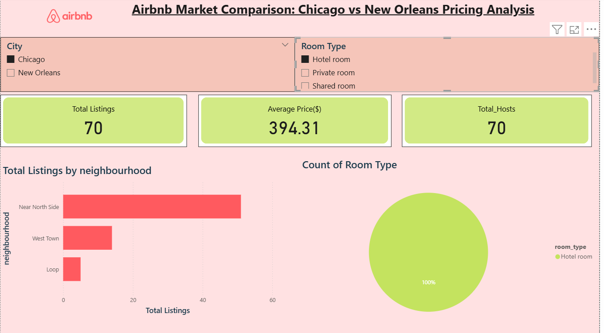

A further Chicago hotel-room filtered view showing the effect of room-type filtering on the dashboard KPIs and neighbourhood analysis.

---

### 12. All Cities — All Room Types

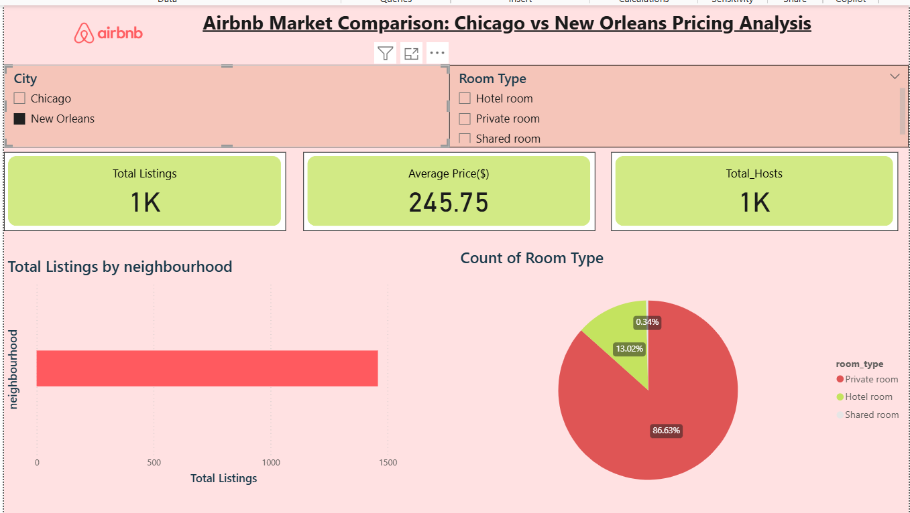

This provides an overall view across the available cities and room types, including the combined listing count, average price and room-type distribution.

---

### 13. Chicago — Private Room Detailed Analysis

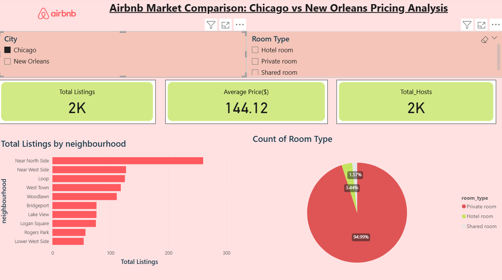

This detailed view shows Chicago private-room listings with neighbourhood-level ranking and room-type composition.

---

### 14. Overall City & Room Type Analysis

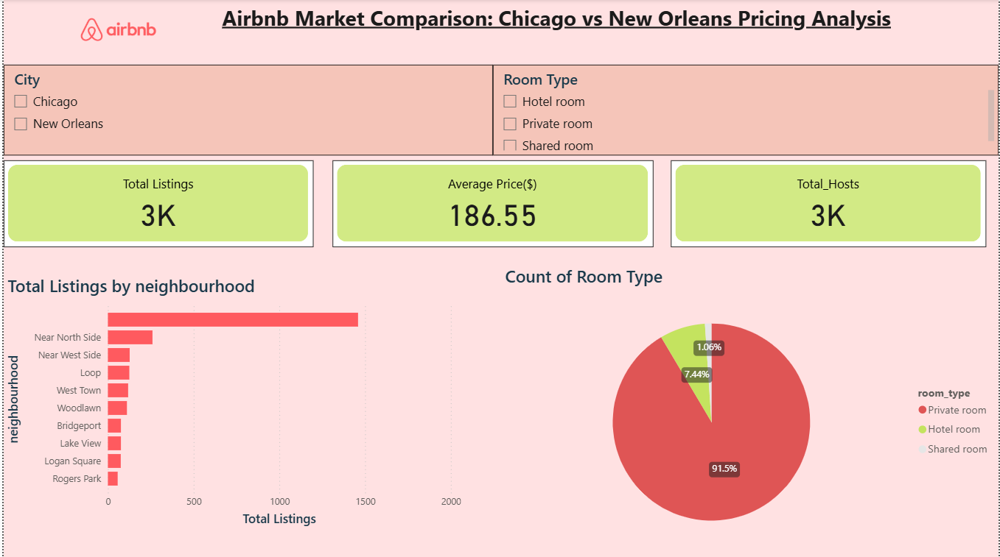

This final view summarizes the broader comparison and shows how listing volume and room-type composition vary across the analysed market.

---

## 🔍 Key Observations

Based on the dashboard screenshots:

- The dashboard supports direct comparison between **Chicago and New Orleans** through city filters.
- **Room type is an important driver of the displayed KPIs**, particularly average price and listing count.
- The screenshots show substantial variation in listing concentration across neighbourhoods.
- **Private rooms represent a large share of listings** in several of the broader views.
- Chicago's filtered views show strong listing concentration in neighbourhoods such as **Near North Side, Near West Side and Loop**.
- New Orleans views show a different listing distribution and pricing pattern compared with Chicago.
- The dashboard's interactive filters make it possible to move from an overall market view to a specific city-and-room-type segment.

> Note: Individual KPI values change according to the selected filters. Therefore, the screenshots should be interpreted as different filtered scenarios rather than as separate datasets.

---

## 💡 Business Insights

The analysis can help Airbnb hosts and market analysts understand:

### Pricing

Average prices vary considerably by city and room type. This can help hosts benchmark their pricing against other listings in the same segment.

### Neighbourhood Opportunity

Neighbourhood-level listing counts can indicate where Airbnb supply is concentrated and where less-saturated areas may exist.

### Room-Type Strategy

The room-type distribution provides insight into the dominant accommodation formats in each market.

### Market Comparison

Chicago and New Orleans display different listing and pricing characteristics, demonstrating why location-specific pricing strategies are important.

---

## 📁 Repository Structure

```text
Airbnb-PowerBI-Project/
│
├── README.md
│
└── Screenshots/
    ├── 01_New_Orleans_Shared_Room_Filter.png
    ├── 02_New_Orleans_Private_Room_Filter.png
    ├── 03_New_Orleans_Hotel_Room_Filter.png
    ├── 04_Chicago_Shared_Room_Filter.png
    ├── 05_Combined_Shared_Room_Comparison.png
    ├── 06_New_Orleans_Overall_View.png
    ├── 07_New_Orleans_Private_Room_View.png
    ├── 08_Chicago_Hotel_Room_View.png
    ├── 09_Chicago_Shared_Room_View.png
    ├── 10_Chicago_Private_Room_View.png
    ├── 11_Chicago_Hotel_Room_View_2.png
    ├── 12_All_Cities_All_Room_Types.png
    ├── 13_Chicago_Private_Room_Detailed.png
    └── 14_Overall_City_Room_Type_Analysis.png
```

---

## ⚠️ Submission Note

The original Power BI `.pbix` file is not included in this repository. The repository is intended to provide a **visual and documented representation of the completed Power BI dashboard** through screenshots.

---

## 👨‍💻 Project

**Project:** Airbnb Market Comparison: Chicago vs New Orleans Pricing Analysis  
**Platform:** Microsoft Power BI  
**Documentation:** GitHub
